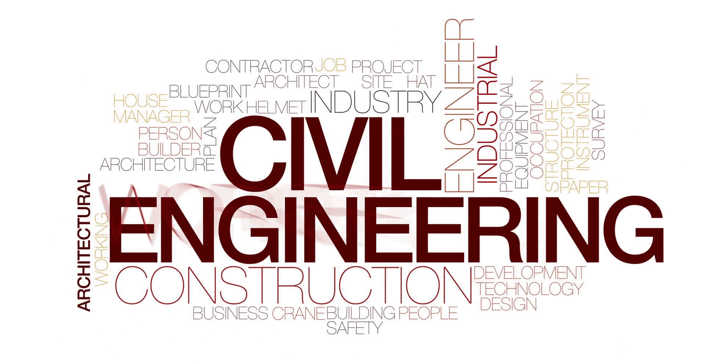

[Python](https://img.shields.io/badge/Python-3776AB?style=for-the-badge&logo=python&logoColor=white)
[AutoCAD](https://img.shields.io/badge/AutoCAD-E00C27?style=for-the-badge&logo=autodesk&logoColor=white)
[Status](https://img.shields.io/badge/Building-MIT%20Profile-green?style=for-the-badge)

# Civil-Projects-Bangladesh 🇧🇩

Hi, I'm **Sabab** from Bogura Polytechnic Institute.  

**Goal:** MIT Civil & Environmental Engineering + AI

### Skills
`AutoCAD` `Civil 3D` `Python` `Structural Analysis` `GIS`

### Current Focus
- Smart Infrastructure for Bangladesh
- AI in Construction 
- Computational Civil Engineering

### Projects
| Project | Status | Tech |
| --- | --- | --- |
| Smart Bridge Monitoring | Coming Soon | Arduino + Python |
| Flood Prediction Model | Coming Soon | Python + Data |

**Let's connect and build the future!**
| Column Load Calculator | Done | Python |
